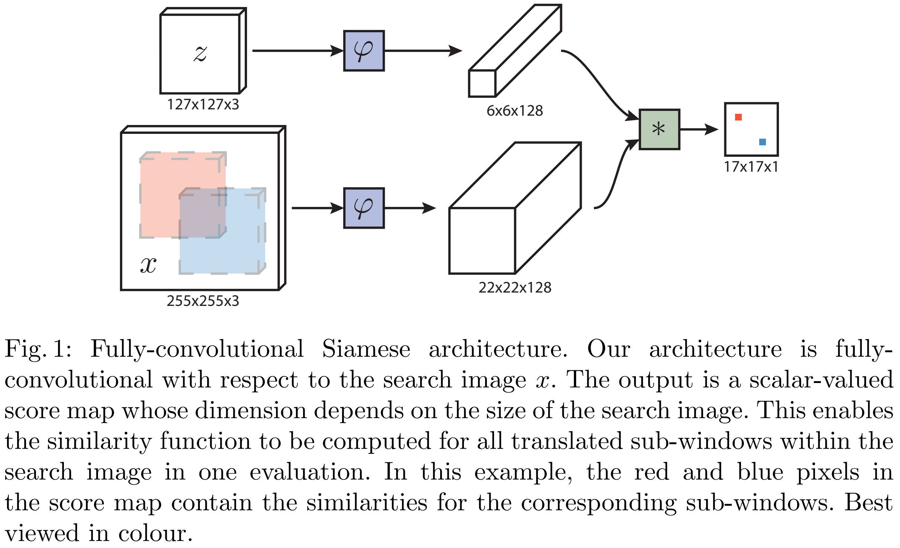

> **ECCV, 2016** 
> [**[Paper](https://arxiv.org/abs/1606.09549)**]

Object tracking 논문들을 볼 때 자주 나오는 search patch와 template patch는 어떻게 만들어진 것인지 본 논문을 통해 알아보았다.

## Contributions
주목할 만한 contritubion은 다음과 같다.
- **Offline Similarity Learning**
  - 초기 딥러닝 기반 detector들은 대부분 추적할 영상이 주어지면 그 영상 내에서 모델을 업데이트하는 방식으로 이뤄졌었다.
  때문에 매 프레임마다 backpropagation을 수행하여 속도가 매우 느려지는 단점이 있다.
  - 이를 보완하기 위해 논문은 tracking 문제를 similarity learning 문제로 재정의한다.
  즉, 두 이미지가 같은 object인지를 판단하는 일반적인 **function**을 배운다.
  - 이 함수는 대규모 데이터셋 (논문에서는 ILSVRC15)에서 사전 학습된다.
- **Fully-Convolutional Siamese Network**
  - 빠른 속도와 높은 정확도를 동시에 달성하기 위해 제안한 구조이다.
  - **Siamese Network**
    - 동일한 구조와 weight를 공유하는 2개의 neural network를 사용한다.
    - 하나는 추적 목표의 template image, 다른 하나는 현재 frame에서 목표를 찾을 search image를 입력으로 받는다.
    - 이 구조를 통해 두 입력의 feature를 동일한 기준으로 추출 & 비교할 수 있다.

## Deep similarity learning for tracking
임의의 object를 추적하는 방법을 similarity learning을 통해 알아본다.

논문은 예시 이미지인 $z$(template image)와 후보 이미지인 $x$의 유사도를 계산하는 함수 $f(z,x)=g(\varphi(z),\varphi(x))$를 제안한다.

$z$는 비디오의 첫 프레임에 주어진 object의 모습으로 고정하여 사용한다.
{: width="80%" height="80%"}
- Fig.1을 보면, 네트워크는 추적할 목표의 template image인$z$와 목표를 찾을 search image$x$로 나뉜다. Search image 내에는 여러 sub-windows가 존재한다.(그림의 빨간색, 파란색 window)
- $z$와 $x$는 각각 동일한 conv. network(논문에서는 MatConvNet) $\varphi$를 통과한다.
- template image는 $6\times6\times128$의 feature map, x는 $22\times22\times128$의 feature map으로 변환된다.
- 두 feature map은 cross-correlation을 통해 결합된다. Template의 $6\times6$ feature를 search feature($22\times22$) 위에서 sliding하며 모든 위치에서의 similarity를 계산한다.
- 최종 output은 $17\times17\times1$ 크기의 score map으로 나온다. 이 map의 각 pixel은 search image의 해당 위치가 template image와 얼마나 유사한 지를 나타내는 점수이다.

### Fully-Convolutional Siamese architecture
논문에서 제안하는 siamese 네트워크를 fully-convolutional형태로 설계했다.
이는 네트워크의 **출력이 입력의 위치 변화에 따라 함께 움직이는 성질**을 의미한다.
이를 통해 큰 search image를 한 번만 네트워크에 입력하면 이미지 내의 모든 후보 위치에 대한 similarity score도 한꺼번에 계산 가능하다.

Fully-convolution 성질은 다음과 같의 정의할 수 있다.

$$h(L_{kr},x)=L_rh(x)$$

이는 입력 $x$를 $kr$만큼 이동시킨 후, 그 결과를 네트워크 h에 통과시킨 값과, 
입력 $x$를 네트워크 $h$에 먼저 통과시킨 후 $r$만큼 이동시키는 과정이 같음을 의미한다.
따라서 $h$는 fully-convolutional 성질을 갖는다고 정의할 수 있다.

다음으로 논문에서 사용한 유사도 함수는 다음과 같다.

$$f(z,x)=\varphi(z)\ast\varphi(x)+b\mathbb{1}$$

Convolution 기반의 feature 추출, feature map 간의 cross-correlation, bias로 이루어져있다.

### Training with large search image
논문에서는 discriminative approach 방식을 사용해 siamese network를 학습한다.
이는 positive pair(여기서는 같은 object)와 negative pair(다른 object 또는 background)를 잘 구별하도록 가르치는 것을 의미한다.

논문에서는 logistic loss를 사용해 유사도 점수($v$)와 gt label($y$)의 loss를 정의한다.

$$l(y,v)=log(1+exp(-yv))$$

이 때 y는 다음과 같이 구할 수 있다.

$$y[u] = \begin{cases}+1 & \text{if } k||u-c|| \leq R \\-1 & \text{otherwise}\end{cases}$$

Score map의 특정 위치 $u$가 실제 object 위치 중심 $c$로부터 특정 반경 $R$ 이내에 있으면 +1, 그렇지 않으면 -1로 label된다.

Score map 전체에 대한 total loss $L$은 $l$의 평균으로 계산된다.

$$L(y, v) = \frac{1}{|\mathcal{D}|} \sum_{u \in \mathcal{D}} \ell(y[u], v[u])$$

따라서 전체 loss 평균을 가장 작게 만드는 방향으로 학습된다.

$$\underset{\theta}{\arg\min} \underset{(z,x,y)}{\mathbb{E}} L(y, f(z,x;\theta))$$

## Experiments
실험 결과 보다는 평가 프로토콜을 살펴보고자 한다.
### Metric
- OPE (One-Pass Evaluation)
1. 벤치마크에 포함된 각 비디오에 대해 첫 프레임에서 tracker를 한 번만 초기화하고 영상 끝까지 추적을 진행한다. 
2. 각 비디오마다 IoU 임계값(0~1)에 따른 success rate을 계산하여 success plot을 그린다. 
3. 모든 비디오의 success plot을 평균내어 benchmark 전체에 대한 최종 success plot을 만들고 AUC를 계산한다.

- TRE (Temporal Robustness Evaluation)
1. 하나의 비디오에 대해, 여러 개의 시작 프레임을 정합니다 (예: 1, 20, 40, 60...). 
2. 각 시작 프레임마다 tracker를 초기화하고 video 끝까지 추적을 진행하는 부분 추적을 여러 번 수행합니다. 
3. 각 부분 추적 결과로부터 success plot을 각각 구한 뒤, 해당 비디오에 대한 평균 TRE success plot을 만든다. 
4. Benchmark의 모든 비디오에 대해 3번 과정을 반복하고, 다시 모든 비디오의 TRE success plot을 평균 → AUC를 계산한다.

- SRE (Spatial Robustness Evaluation)
1. 하나의 video에 대해 첫 frame의 정답 bbox를 공간적으로 약간씩 변형(중심점 이동, 크기 조절 등) → 여러 개의 왜곡된 초기 박스를 만든다. 
2. 각각의 왜곡된 초기 bbox로 tracker를 초기화하고 영상 끝까지 추적을 진행하는 것을 여러 번 반복한다. 
3. 각 실행 결과로부터 success plot을 각각 구한 뒤, 이들을 평균내어 해당 비디오에 대한 SRE success plot을 만든다.
4. Benchmark의 모든 비디오에 대해 3번 과정을 반복하고, 다시 모든 비디오의 SRE success plot을 평균 → AUC를 계산한다.
