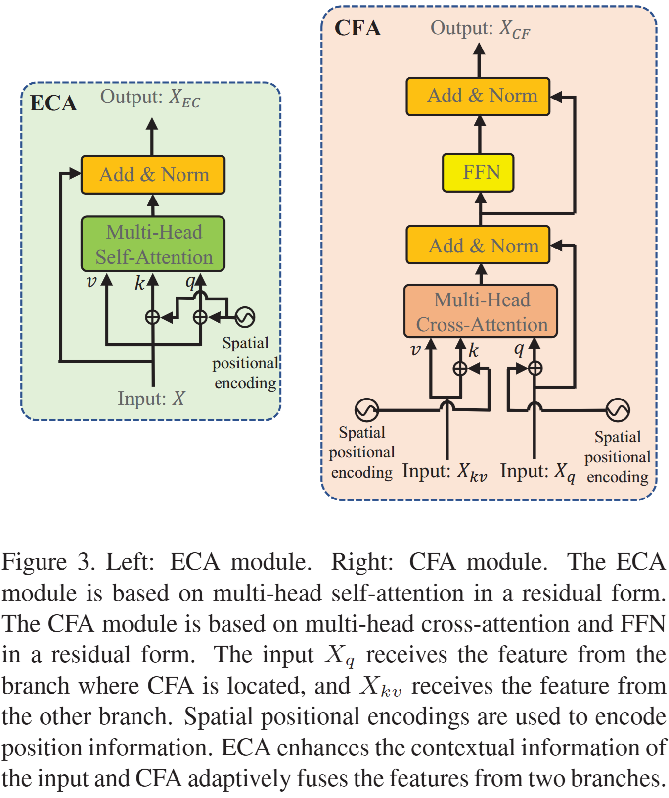

> **CVPR, 2021** 
> [**[Paper](https://openaccess.thecvf.com/content/CVPR2021/html/Chen_Transformer_Tracking_CVPR_2021_paper.html)**]
> [**[Code](https://github.com/chenxin-dlut/TransT)**]

Object tracking 분야에서 Transformer를 적용한 초기 연구 중 하나이다.

## Introduction
기존의 object tracking method는 siamese 방식으로, emplate과 search가 얼마나 비슷한지를 계산하는 방식이다.
이는 correlation 연산 방식을 따르는데, 연산 자체가 'local linear matching' 과정이라, 전체적인 semantic 정보를 잃기 쉽고, local optimum에 빠질 수 있다.
따라서 논문은 Transformer의 핵심 아이디어인 **attention**으로 correlation 연산을 대체하는 네트워크를 제안한다.

## Contributions
- Transformer 기반의 object tracking network 제안
  - correlation 추출 → attention 기반 fusion → 결과 예측
- Ego-context augment (ECA)와 cross-feature augment (CFA) 모듈 제안
  - Ego-context augment (ECA) : self-attention을 기반으로 하는 모듈로, 각 이미지(template or search 이미지 각각) 내부에서 어떤 부분이 중요하지 파악한다.
  - Cross-feature augment (CFA) : cross-attention을 기반으로 하는 모듈로, template과 search 이미지가 서로 정보를 주고 받으며 융합되는 과정이다.

## Transformer Tracking

Figure2를 보면 알 수 있듯 TransT는 총 3개의 구성요소가 존재한다. 

### Backbone network
Template image와 search image의 특징을 추출한다. 
- Template image($z$) : tracking할 object ($128\times128$)
- Search region($x$) : object를 찾아야 할 input ($256\times256$)

ResNet50을 backbone으로 활용하였다. 깊은 레이어로 발생하는 위치 정보 손실을 완화하고자 backbone의 맨 마지막 stage를 제거하고, 4번째 stage의 downsampling stride를 2에서 1로 줄였다.
따라서 resolution이 큰 feature map을 얻을 수 있다.

$(f_z) : 1024\times16\times16$, $(f_x) : 1024\times32\times32$

### Feature fusion network
- $1\times1$ convolution을 사용해서 채널을 줄여주고 flatten시켜준다. 

  $(f_{z1}) : 1024\times16\times16→256\times16\times16→256\times256$

  $(f_{x1}) : 1024\times32\times32→256\times32\times32→256\times1024$

> Multi-head attention : ECA와 CFA 모듈을 만드는 데 사용된 기본 블록
>> Attention의 기본 아이디어는 내가 궁금한 것(Query)과 관련된 정보(key)를 비교해서 그 관련도만큼 실제 정보(Value)를 가져오는 것이다.
>>
>> $$\text{Attention}(\mathbf{Q}, \mathbf{K}, \mathbf{V}) = \text{softmax}\left(\frac{\mathbf{Q}\mathbf{K}^T}{\sqrt{d_k}}\right)\mathbf{V}$$
> 
> **Multi-head attention** : 여러 관점에서 동시에 주목하는 것
> 
> 서로 다른 관점을 가진 $h$개의 작은 $Q, K, V$로 나누어준다. 이 때 곱해지는 $W$matrix가 각 관점(=head, $n_h$)을 학습한다.
> 
> $$\mathbf{H}_i = \text{Attention}(\mathbf{Q}\mathbf{W}_i^Q, \mathbf{K}\mathbf{W}_i^K, \mathbf{V}\mathbf{W}_i^V)$$
>
> $$\text{MultiHead}(\mathbf{Q}, \mathbf{K}, \mathbf{V}) = \text{Concat}(\mathbf{H}_1, ..., \mathbf{H}_{n_h})\mathbf{W}^O$$

{: width="60%" height="60%"}

#### Ego-Context Augment
- Template이나 Search region이 자기 자신 안에서 중요도를 파악해서 특징을 풍부하게 만드는 과정이다. (기본적인 self-attention과 동일한 모듈)

$$\mathbf{X}_{EC} = \mathbf{X} + \text{MultiHead}(\mathbf{X} + \mathbf{P}_x, \mathbf{X} + \mathbf{P}_x, \mathbf{X})$$

- $Q, K, V$가 각각 $\mathbf{X} + \mathbf{P}_x, \mathbf{X} + \mathbf{P}_x, \mathbf{X}$가 된다. ($\mathbf{P}_x$는 positional encoding)
- 이후 Residual connection을 추가한다.

#### Cross-Feature Augment Module
- Template region과 search region의 **key와 value를 공유**한다.

  $$\mathbf{\tilde{X}}_{CF} = \mathbf{X}_q + \text{MultiHead}(\mathbf{X}_q + \mathbf{P}_q, \mathbf{X}_{kv} + \mathbf{P}_{kv}, \mathbf{X}_{kv})$$

  - 이 때 $X_{kv}$는 다른 region (template이라면 **search region**, search라면 **template region**)의 key, value이다.
  - 이후 FFN을 통해 비선형 변환을 추가해주어 벡터 자체를 한 번 더 깊이있게 처리해준다.
  
  $$\text{FFN}(\mathbf{x}) = \text{max}(0, \mathbf{x}\mathbf{W}_1 + \mathbf{b}_1)\mathbf{W}_2 + \mathbf{b}_2$$

  $$\mathbf{X}_{CF} = \mathbf{\tilde{X}}_{CF} + \text{FFN}(\mathbf{\tilde{X}}_{CF})$$

### Prediction head
Feature fusion network의 최종 출력을 입력으로 받는다. 이후 prediction head는 2개의 브랜치로 나뉜다.

- Classification branch : 각 위치가 foreground인지 background인지 판별한다. 1024개의 vector에 대해 확률 score를 출력한다.
- Regression branch : object가 있다면 bbox의 좌표를 예측한다. 1024개의 vector에 대해 bbox의 좌표를 출력한다.

### Training Loss
논문에서는 classification loss와 regression loss를 합쳐 최종 loss를 계산한다. Positive sample을 gt bbox 내부에 위치한 prediction으로, negative sample을 그 외의 prediction으로 분류한다.

일반적으로 배경에 해당하는 negative sample 수가 positive보다 훨씬 많기 때문에 논문에서는 negative sample의 가중치를 16배 낮추어 positive sample 학습에 집중하도록 했다.

- Classification loss : binary cross-entropy loss를 사용한다.

  $$\mathcal{L}_{cls} = -\sum_j [y_j\log(p_j) + (1-y_j)\log(1-p_j)]$$

- Regression loss : positive sample에 대해서만 계산하고, l1 loss와 generalized IoU loss를 사용한다.

  $$\mathcal{L}_{reg} = \sum_j \mathbf{1}_{\{y_j=1\}} [\lambda_G\mathcal{L}_{GIoU}(b_j, \hat{b}_j) + \lambda_1\mathcal{L}_{1}(b_j, \hat{b}_j)]$$

## Experiments
- COCO, TrackingNet, LaSOT, GOT-10k 데이터셋을 사용했다. 비디오 데이터셋에서는 이미지 pair를 샘플링하고, COCO의 경우 이미지 데이터셋이기 때문에 약간의 transformation을 통해 pair를 생성했다.
- 실제 tracking 단계에서는 예측 결과에 간단한 후처리(Hanning window panelty)를 적용한다.
> Hanning window : 이전 frame의 target 위치를 중심으로 점수가 가장 높고, 중심에서 멀어질수록 0으로 떨어지는 종 모양의 함수 

$$score_w = (1-w) \times score + w \times score_h$$

- 논문에서는 $w=0.49$로 설정했다. 즉 모델 score를 51%, 위치 안정성을 49% 반영한 셈이다.

### Results

#### Metric
- $AUC$ (Area Under Curve)
  - IoU를 통해 prediction과 gt의 overlap으로 계산 → 그래프의 아래쪽 면적을 구한다.
- $P$ (Precision)
  - Pred box와 gt box의 중심점 간의 거리(Center Location Error, CLE)를 평가한다.
  - CLE가 threshold(보통 20pixel)보다 작으면 성공으로 간주한다.
- $P_Norm$ (Normalized Precision)
  - CLE를 bt box의 대각선 길이로 나누어 정규화한다.
  - General한지 여부를 판단할 때 유용하다. 
- $AO$ (Average Overlap)
  - Object를 끝까지 추적하는 데 성공한 video에 대해서 계산한다.
  - 해당 영상의 모든 frame에 대해 IoU 평균을 계산한다.
- $SR$ (Success Rate)
  - Tracker가 영상을 실패 없이 추적했는지에 대한 비율
  - IoU가 threshold 아래로 한 번이라도 떨어지면 실패로 간주한다.
