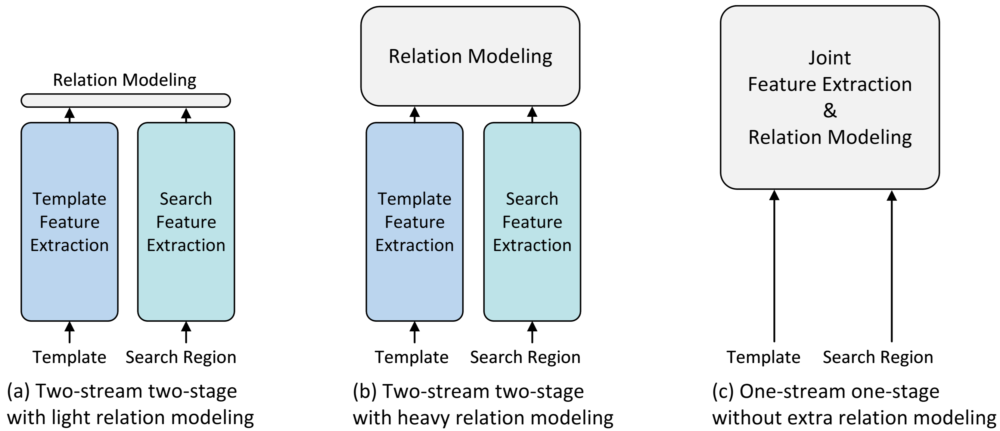
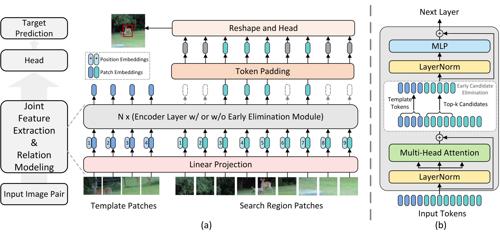
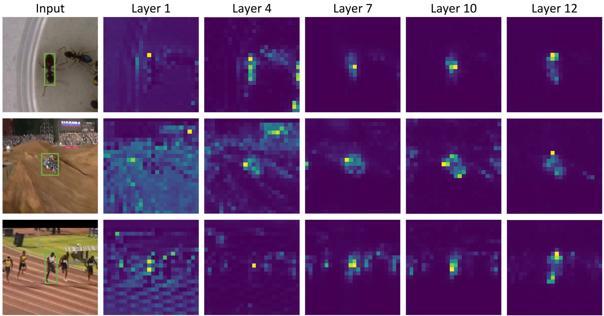
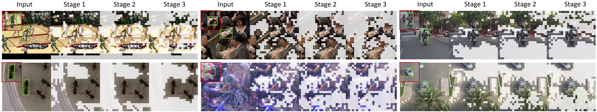
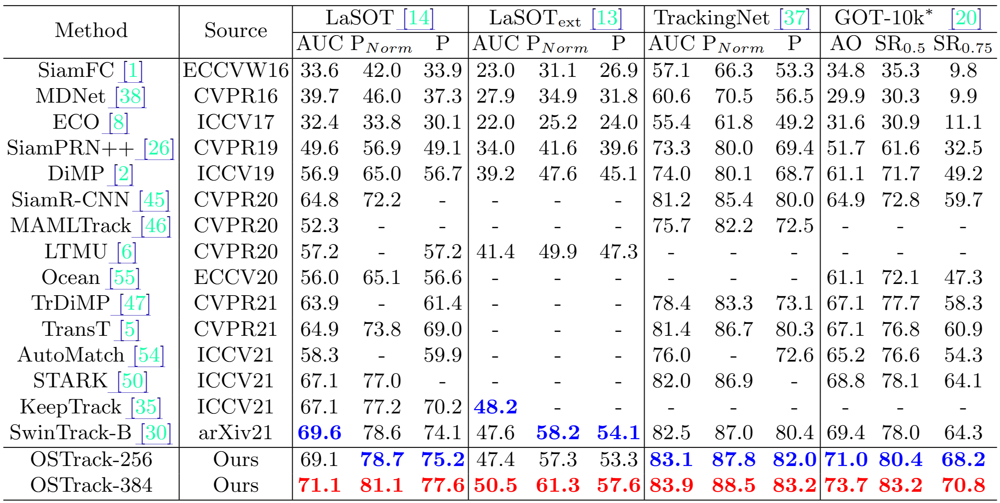

> **ECCV, 2022** 
> [**[Paper](https://arxiv.org/abs/2203.11991)**]
> [**[Code](https://github.com/botaoye/OSTrack)**]

Object tracking 분야에서 가장 많이 보이는 논문이라 읽어보았다.

## Introduction
{: width="90%" height="90%"}
- 기존의 Visual object tracking(VOT)의 방식
  1. Two-Stream : Template image와 search image의 특징을 독립적인 pipeline으로 추출
  2. Two-Stage : 각각의 특징 추출 → correlation 모델링의 진행순서로 이루어져있음
  - **Light relation modeling ([fig.2(a)](#introduction))**
    - 초기 Siamese network 기반 tracker들이 주로 사용하던 방식으로 cross-correlation과 같은 가벼운 기능 하나로 template과 search의 관계를 계산한다.
    - 계산이 단순해 속도가 매우 빠른 장점이 있으나, 섬세하고 중요한 정보를 많이 놓치게 된다. 즉, **빠르지만, 정확도가 떨어진다**.
  - **Heavy relation modeling ([Fig.2(b)](#introduction))**
    - 최근 Transformer를 도입한 tracker들이 사용하는 방식으로 ([TransT](https://arxiv.org/abs/2203.11991), [STARK](https://openaccess.thecvf.com/content/ICCV2021/html/Yan_Learning_Spatio-Temporal_Transformer_for_Visual_Tracking_ICCV_2021_paper.html)), (a)에서 언급한 정보 손실 문제를 해결하기 위해 등장한 방식이다.
    - 양방향 정보를 깊이 있게 분석하기 때문에 정보 손실이 적고 정확도가 높으나, cost가 높고 추론 속도가 느린 단점이 있다. 즉, **정확하지만 느리다**.
  - 이와 같은 문제를 해결하고자 논문에서는 모든 과정을 하나로 합친 **One-Stream, One-Stage** 프레임워크를 제안한다.

## Contributions
- 새로운 **One-Stream tracking framework** 제안
  - 기존의 Two-Stream network 방식의 딜레마를 근본적으로 해결하는 새로운 방식을 제안한다.
- 추론 속도를 높이는 **early candidate elimination** 모듈 제안
  - Background에 해당하는 후보들을 미리 식별하고 계산 과정에서 버리는 과정을 통해 불필요한 연산량을 줄이고, 추론 속도를 크게 향상시키는 모듈을 제안한다.

## Method

논문의 key idea는 **template과 search region 사이에 자유로운 정보의 흐름을 만드는 것**이다. 이 목표를 달성하기 위해 ViT의 self-attention을 활용한다. 또한 pre-trained 모델을 활용하여 학습을 진행하였다.

입력 이미지를 patch로 조각내고, linear projection layer를 통해 1-D vector로 변환하는 patch embedding ($\mathbf{E}$), 그리고 위치 정보를 포함하는 position embedding ($\mathbf{P}$)을 추가하는 과정은 ViT와 동일하다. 이 과정을 template과 search region에 대해 수행한다. 수식으로 표현하면 아래와 같다.

$$\mathbf{H}_z^0 = [\mathbf{z}_p^1\mathbf{E}; \mathbf{z}_p^2\mathbf{E}; \dots; \mathbf{z}_p^{N_z}\mathbf{E}] + \mathbf{P}_z, \quad \mathbf{E} \in \mathbb{R}^{(3, P^2)\times D}, \mathbf{P}_z \in \mathbb{R}^{N_z\times D},$$

$$\mathbf{H}_x^0 = [\mathbf{x}_p^1\mathbf{E}; \mathbf{x}_p^2\mathbf{E}; \dots; \mathbf{x}_p^{N_x}\mathbf{E}] + \mathbf{P}_x, \quad \mathbf{P}_x \in \mathbb{R}^{N_x\times D}$$

마지막으로 token sequence를 concat해 최종 결과 vector $\mathbf{H}_{zx}^0$를 만든다 ($$\mathbf{H}_{zx}^0 = [\mathbf{H}_z^0; \mathbf{H}_x^0]$$).
그리고 이 합쳐진 sequence를 transformer encoder layer에 통과시킨다.
이렇게 모든 정보를 처음부터 합쳐서 self-attention을 적용하는 방식은 기존 2nd stage였던 cross-attention 방식보다 병렬화에 유리해서 속도가 빠르다.

참고로, 논문에서는 두 가지 버전의 모델을 제시했는데, 각각의 입력 크기는 다음과 같다.

- OSTrack-256
  - Template($z$) :$128\times128$ pixels, Search($x$) : $256\times256$ pixels
- OSTrack-384
  - Template($z$) :$192\times192$ pixels, Search($x$) : $384\times384$ pixels

### Joint Feature Relation Modeling
Self-attention은 $Q,K,V$라는 세 가지 요소를 사용한다. 이 때 attention의 가중치를 살펴보면 다음과 같다.

$$\mathbf{A} = \text{Softmax}\left(\frac{\mathbf{Q}\mathbf{K}^T}{\sqrt{d_k}}\right)\cdot\mathbf{V} = \text{Softmax}\left(\frac{[\mathbf{Q}_z; \mathbf{Q}_x][\mathbf{K}_z; \mathbf{K}_x]^T}{\sqrt{d_k}}\right)[\mathbf{V}_z; \mathbf{V}_x],$$

이 때 $V$와 곱해지는 softmax 부분은 아래와 같이 표현할 수 있다.

$$\text{Softmax}\left(\frac{[\mathbf{Q}_z; \mathbf{Q}_x][\mathbf{K}_z; \mathbf{K}_x]^T}{\sqrt{d_k}}\right) = \text{Softmax}\left(\frac{\mathbf{Q}_z\mathbf{K}_z^T; \mathbf{Q}_z\mathbf{K}_x^T; \mathbf{Q}_x\mathbf{K}_z^T; \mathbf{Q}_x\mathbf{K}_x^T}{\sqrt{d_k}}\right) \overset{\triangle}{=} [\mathbf{W}_{zz}, \mathbf{W}_{zx}, \mathbf{W}_{xz}, \mathbf{W}_{xx}]$$

각 weight matrix를 해석해보자면 다음과 같다.
- $\mathbf{W}_{zz}$ : template region 내부의 관계
- $\mathbf{W}_{zx}$ : template의 각 부분이 search region의 각 부분과 얼마나 유사한지 (template patch가 search region의 어디와 닮았는가?)
- $\mathbf{W}_{xz}$ : search의 각 부분이 template region의 각 부분과 얼마나 유사한지 (search patch가 template과 얼마나 닮았는가?)
- $\mathbf{W}_{xx}$ : search region 내부의 관계

따라서 최종적인 attention은 다음과 같이 표현 가능하다.

$$\mathbf{A} = [\mathbf{W}_{zz}\mathbf{V}_z + \mathbf{W}_{zx}\mathbf{V}_x; \mathbf{W}_{xz}\mathbf{V}_z + \mathbf{W}_{xx}\mathbf{V}_x]$$

결과적으로 OSTrack이 기존 2-Stream Tracker에 비해 유리하게 작용되는 부분은 다음과 같다.
1. Feature 추출 방식의 차이 (Adaptation) : feature 추출과 relation modeling이 완벽하게 통합됨 → mutual guidance를 통해 target-oriented feature를 뽑아낼 수 있다.
2. Pre-trained backbone : 모델 전체가 ViT를 활용하기 때문에 빠른 수렴 속도를 보인다. 
3. 배경 제거에 대한 새로운 가능성 → early candidate elimination

### Early Candidate Elimination

OSTrack이 기반으로 하는 ViT-Base 모델은 총 12개의 encoder layer로 구성되어 있다.
그런데 [fig.4](#early-candidate-elimination)에서 볼 수 있듯 **네트워크의 아주 초기 계층에서 (Layer4)부터 이미 attention weight가 target 주변을 바라보고 있는 것**을 알 수 있다. 따라서 배경일 게 확실한 후보들은 미리 계산에서 제외하는 아이디어를 구현한 것이 **early candidate elimination**이다.
네트워크 내부에서 점차적으로 background candidates를 식별&제거함으로써 **속도를 향상**시키고 background noise를 줄여 **성능 향상**의 효과를 얻을 수 있다. 논문에서는 4, 7, 10번째 layer에 early candidate elimination을 적용하였다.

Early candidate elimination 과정 : **similarity 점수 계산 → 대표 score 선정 → 최종 score 확정 → candidate 제거**

1. $i$번째 template token $h_z^i$ 고려했을 때 업데이트 되는 수식은 다음과 같다.

   $$\mathbf{h}_z^i = \text{Softmax}\left(\frac{\mathbf{q}_i \cdot [\mathbf{K}_z; \mathbf{K}_x]^T}{\sqrt{d}}\right) \cdot \mathbf{V} = [\mathbf{w}_z^i; \mathbf{w}_x^i] \cdot \mathbf{V}$$

   여기서 $\mathbf{w}_x^i$는 $i$번째 template token과 모든 search region 사이의 similarity를 가진다.
2. Template 전반에 존재하는 background noise를 피하기 위해 모든 template token의 similarity를 사용하지 않는 대신, template 정중앙에 위치한 **대표 token 1개($\phi$)가 계산하는 similarity vector $\mathbf{w}_x^{\phi}$만 선택**한다.
3. ViT는 M개의 attention head를 가진다(multi-head). 따라서 실제로는 M개의 서로 다른 similarity vector가 계산된다. 논문은 이 M개의 vector들을 element-wise로 평균내어 최종 similarity score를 얻는다.

   $$\bar{w}_x^\phi = \frac{1}{M}\sum_{m=1}^M w_x^\phi(m)$$

   따라서 $\bar{w}_x^\phi$는 각 search region candidate이 template과 얼마나 유사한지에 대한 최종 평가점수가 된다.
4. $\bar{w}_x^\phi$ 를 기준으로 모든 search region candidate의 순위를 매기고 top-k 방식으로 최종 candidates를 선별한다.
논문에서는 token keeping ration$\rho$를 사용해 동적으로 k를 조절했다.

Early candidate elimination의 결과는 위 그림과 같다.

### Head and Loss
Head는 ViT를 통과해 나온 feature map을 가지고 최종 bbox를 만들어 낸다.
1. Early candidate elimination 결과, 살아남은 token sequence를 다시 2D 공간의 feature map 형태로 복원하고, 빠진 부분은 zero-padding 해준다.
2. 2D feature map을 FCN에 넣어준다. FCN은 L stacked Conv. → BN → ReLU로 구성되어 있다.
3. Head는 세 종류의 prediction map을 출력한다.
   - **Classification score map ($P$)** : 각 위치가 target의 중심일 확률을 계산한다. 1-channel의 확률 map.
   - **Local offset map ($O$)** : Feature map의 해상도 한계로 인한 discretization error를 보정한다. 2-channel(x,y coordinate)값을 출력한다.
   - **Normalized bbox size ($S$)** : 각 위치에서 target의 width와 height를 예측한다. 2-channel(w, h)값을 출력한다.

최종적인 **target bbox**는 다음과 같이 구해진다.

  $$(x, y, w, h) = (x_d + O(0, x_d, y_d), y_d + O(1, x_d, y_d), S(0, x_d, y_d), S(1, x_d, y_d))$$

OSTrack에서는 세 종류의 loss를 사용한다.
1. **Classification loss ($L_{cls}$)** : classification score map($P$)를 위한 loss function으로, weighted focal loss를 사용한다.
2. **L1 loss ($L_1$)** : bbox 예측을 위한 loss function
3. **Generalized IoU loss ($L_{iou}$)** : bbox 예측을 위한 또 다른 loss fuction으로, 예측된 bbox와 gt bbox가 얼마나 겹치는지를 측정한다.
전체 loss function은 다음과 같다.

$$L_{\text{track}} = L_{\text{cls}} + \lambda_{\text{iou}}L_{\text{iou}} + \lambda_{L1} L_{L1}$$

실험에서는  $\lambda_{iou}=2$, $\lambda_{L_1}=5$로 설정했다.
## Experiments
- Train 환경 : A100 4대
- Inference 환경 : RTX2080Ti 1대

### Results

